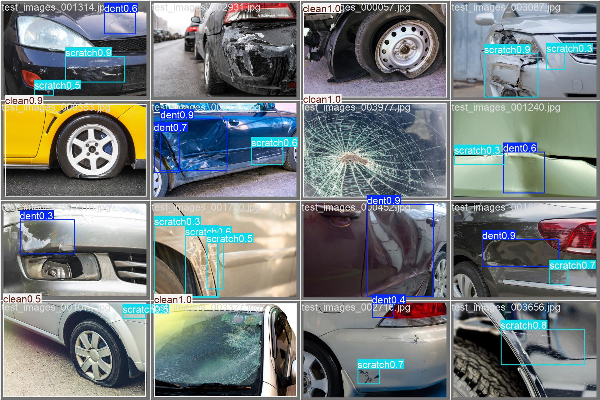
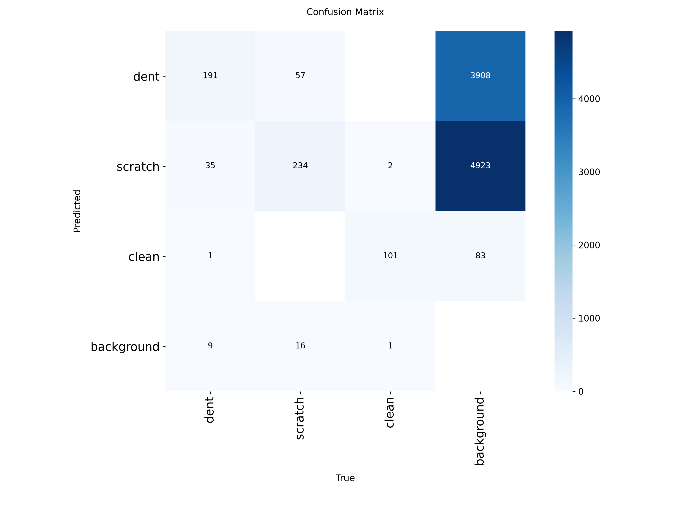

# Vehicle Damage Detection System


## Solution Overview

The proposed solution is an end-to-end computer vision system for detecting two common types of vehicle damage: **scratches and dents**.

### Dataset Source

The dataset used for this project is the **CarDD with YOLO Annotations (Images + Labels)** dataset, available on Kaggle:

https://www.kaggle.com/datasets/gabrielfcarvalho/cardd-with-yolo-annotations-images-labels

The dataset is based on the **Car Damage Detection Dataset (CarDD)** and contains vehicle images with YOLO-format bounding-box annotations for different types of car damage.

### Dataset Statistics

The original dataset contains images of vehicles with multiple categories of damage. For this project, the dataset was filtered to focus specifically on the two damage categories relevant to the vehicle damage detection task:

- **Dent**
- **Scratch**

During preprocessing, all annotations belonging to other damage categories were removed. Images that contained at least one **dent** or **scratch** annotation were retained, while images without either target class were excluded.

The resulting filtered dataset contains **6,138 annotated damage instances** across the two target classes.


### Class Distribution

The dataset contains **4,000 images** divided into training, validation, and test sets. The original CarDD annotations were processed to retain **dent** and **scratch** bounding boxes. Images containing only other types of damage, such as cracks, broken lamps, shattered glass, or flat tyres, were retained and labelled as **clean** for this task.

| Split | Images | Images with Dent | Images with Scratch | Images Labelled Clean |
|---|---:|---:|---:|---:|
| Train | 2,816 | 1,242 | 1,507 | 715 |
| Validation | 810 | 352 | 431 | 207 |
| Test | 374 | 157 | 183 | 104 |
| **Total** | **4,000** | **1,751** | **2,121** | **1,026** |

The model uses three target classes:

- **Class 0 — Dent:** Images containing one or more dent annotations.
- **Class 1 — Scratch:** Images containing one or more scratch annotations.
- **Class 2 — Clean:** Images with no retained dent or scratch annotations. These images may contain other types of vehicle damage that are outside the scope of this model.

> **Note:** An image can contain multiple damage types, so the class counts represent the number of images containing each class and therefore do not necessarily sum to the total number of images.


## API

The Vehicle Damage Detection System provides a **FastAPI-based REST API** for detecting vehicle **scratches and dents** from uploaded images.

The API provides three main endpoints:

| Endpoint | Method | Description |
|---|---|---|
| `/health` | `GET` | Checks whether the API is running and whether the detection model is loaded. |
| `/predict` | `POST` | Accepts a vehicle image and returns detected damage classes, bounding boxes, and confidence scores. |
| `/predict/annotated` | `POST` | Accepts a vehicle image and returns the image with bounding boxes drawn around detected damage. |

### Health Check

```http
GET /health
```

The health endpoint can be used to verify that the API is running and that the YOLO damage detection model has been successfully loaded.

Example response:

```json
{
  "status": "ok",
  "model_loaded": true
}
```

### Damage Prediction

```http
POST /predict
```

The prediction endpoint accepts an image of a vehicle and uses the trained YOLOv8n model to detect visible **scratches** and **dents**.

The response contains information about the detected damage, including:

- Damage class.
- Confidence score.
- Bounding-box coordinates.

This endpoint is useful when another application needs to consume the model's predictions programmatically.

### Annotated Prediction

```http
POST /predict/annotated
```

The annotated prediction endpoint performs the same vehicle damage detection process but returns the uploaded image with bounding boxes drawn around the detected scratches and dents.

This endpoint is useful when users want to visually inspect the model's predictions and see exactly where the detected damage is located on the vehicle.

### Supported Image Formats

The API accepts the following image formats:

- JPEG
- JPG
- PNG
- WebP

Uploaded images are validated before inference, and images exceeding the configured maximum file size are rejected.

### Interactive API Documentation

The API includes automatically generated interactive documentation using FastAPI's Swagger UI.

After starting the application, the documentation can be accessed at:

```text
http://localhost:8000/docs
```

The Swagger interface allows users to:

1. Select an API endpoint.
2. Upload a vehicle image.
3. Run the damage detection model.
4. View the returned predictions or annotated image.

This provides a simple way to test and interact with the vehicle damage detection model without requiring users to write API client code.


### Setup

Follow the steps below to set up and run the Vehicle Damage Detection System locally using Docker.

### Prerequisites

Before getting started, make sure the following tools are installed on your system:

- [Git](https://git-scm.com/)
- [Docker](https://www.docker.com/)
- [uv](https://docs.astral.sh/uv/) *(optional if you only want to run the application using Docker)*

You can verify that the required tools are installed by running:

```bash
git --version
docker --version
```

If you plan to run the project locally without Docker, you should also verify that `uv` is installed:

```bash
uv --version
```

---

### Step 1: Clone the Repository

Clone the repository from GitHub:

```bash
git clone <repository-url>
```

Navigate into the project directory:

```bash
cd vehicle-damage-detection
```


---

### Step 2: Set Up the Python Environment (Optional)

If you want to run the application directly on your local machine before using Docker, the project uses `uv` for Python dependency management.

Synchronise the project dependencies using:

```bash
uv sync
```

This will create a virtual environment and install the dependencies defined in `pyproject.toml` using the versions locked in `uv.lock`.

Activate the virtual environment:

#### Linux / macOS

```bash
source .venv/bin/activate
```

#### Windows

```powershell
.venv\Scripts\activate
```

Run this to initiate all the packages
```bash
uv pip install -e .
```

You can then run the application locally using:

```bash
uv run uvicorn src.app.main:app --host 0.0.0.0 --port 8000
```

However, running the application locally is optional. The recommended deployment method for this project is through Docker.


---

### Quick Start with Docker

If you already have Docker installed and the project is configured correctly, the complete setup can be reduced to:

```bash
# Clone the repository
git clone https://github.com/hope205/Vehicle-Damage-Detection

# Navigate to the project
cd vehicle-damage-detection

# Build the Docker image
docker build -t vehicle-damage .

# Run the container
docker run -p 8000:8000 vehicle-damage:latest
```

After starting the container, open the FastAPI documentation in your browser:

```text
http://localhost:8000/docs
```

You can then interact with the vehicle damage detection API directly from the Swagger UI.

---

### Training Methodology

The model training process was performed using the filtered CarDD dataset containing annotations for three vehicle damage categories: **dent**, **scratch** and **clean**

I built the model making use of a transfer learning approach. I performed tranafer learning a yolo26m model. The model training was performed on Kaggle using **NVIDIA Tesla T4 GPUs**. The data was trainned on for 50 epoch with image size of 640.


### Model Evaluation

The trained YOLO object detection model was evaluated on a held-out validation dataset using standard object detection metrics. The evaluation measures how accurately the model detects and localizes different categories of vehicle damage.

### Overall Performance

| Metric | Score |
|--------|------:|
| Precision | **79.87%** |
| Recall | **67.68%** |
| F1-Score | **73.27%** |
| mAP@0.5 | **74.29%** |
| mAP@0.5:0.95 | **56.63%** |

### Per-Class Performance

| Class | Precision | Recall | F1-Score | mAP@0.5 | mAP@0.5:0.95 |
|------|----------:|-------:|---------:|---------:|-------------:|
| Dent | 76.74% | 58.90% | 66.65% | 63.73% | 37.04% |
| Scratch | 69.44% | 54.72% | 61.21% | 61.48% | 35.48% |
| Clean | 93.44% | 89.42% | 91.39% | 97.67% | 97.35% |

## Metric Interpretation

### Precision (79.87%)

Precision measures the proportion of predicted damage detections that are actually correct. A precision of **79.87%** indicates that when the model predicts a damage region, it is correct nearly **4 out of every 5 times**, resulting in relatively few false positive detections.

### Recall (67.68%)

Recall measures the model's ability to detect all actual damage instances. A recall of **67.68%** means the model successfully identifies approximately **two-thirds of all damages**, while some damage regions remain undetected.

### F1-Score (73.27%)

The F1-score is the harmonic mean of precision and recall, providing a balanced measure of detection performance. The model achieves an overall **F1-score of 73.27%**, indicating a good balance between minimizing false positives and detecting true damage instances.

### mAP@0.5 (74.29%)

Mean Average Precision at an IoU threshold of 0.5 evaluates both classification and localization performance. A score of **74.29%** indicates that the model performs well at identifying and localizing vehicle damage when a moderate overlap between predicted and ground-truth bounding boxes is required.

### mAP@0.5:0.95 (56.63%)

This metric averages performance across multiple IoU thresholds (0.50 to 0.95), making it a much stricter evaluation of localization accuracy. The score of **56.63%** shows that while the model detects damage effectively, there is still room for improvement in predicting highly accurate bounding box locations.


## Class-wise Analysis

### Clean

The **Clean** class achieved the strongest performance across all metrics:

- Precision: **93.44%**
- Recall: **89.42%**
- F1-Score: **91.39%**
- mAP@0.5: **97.67%**

These results indicate that the model can reliably distinguish undamaged vehicles from damaged ones with very high confidence and localization accuracy.

### Dent

The **Dent** class achieved moderate performance:

- Precision: **76.74%**
- Recall: **58.90%**
- F1-Score: **66.65%**

The model is generally accurate when predicting dents but misses a noticeable number of dent instances. This may be due to varying dent sizes, lighting conditions, or subtle surface deformations that are difficult to detect.

### Scratch

The **Scratch** class proved to be the most challenging:

- Precision: **69.44%**
- Recall: **54.72%**
- F1-Score: **61.21%**

Scratches are often thin, small, and visually similar to reflections or shadows, making them harder to localize accurately. This is reflected in the comparatively lower recall and localization metrics.

**Example predictions**




### Error Analysis




## Business Applications

This vehicle damage detection model can be integrated into several real-world workflows to automate inspections and reduce manual effort.

### Car Rental and Fleet Management

Rental companies and fleet operators can use the model to automatically inspect vehicles during check-in and check-out. By detecting dents and scratches from uploaded images, the system can:

- Identify new damage before and after rentals.
- Reduce disputes between customers and rental providers.
- Generate consistent inspection reports.
- Minimize manual inspection time.
- Speed up vehicle turnaround and availability.

### Auto Insurance Claims Processing

Insurance providers can leverage the model to automate the initial assessment of vehicle damage submitted by policyholders. The system can:

- Pre-screen uploaded claim images.
- Detect and classify visible vehicle damage.
- Automatically populate claim information with detected damage types.
- Prioritize claims requiring immediate attention.
- Reduce the workload of claims adjusters by automating the first stage of damage assessment.

### Vehicle Service and Repair Centres

Automotive repair workshops can integrate the model into their inspection process to provide faster and more consistent damage assessments. This enables technicians to:

- Quickly identify visible damage before repairs begin.
- Generate preliminary repair reports.
- Improve consistency across inspections.
- Reduce the time spent on manual visual assessments.

### Used Vehicle Inspection

Dealerships and vehicle inspection companies can use the model during vehicle valuation and certification processes to automatically identify exterior damage before resale, helping ensure transparent and standardized vehicle condition reports.

### Fleet Maintenance

Organizations operating large fleets, such as logistics companies and ride-hailing services, can continuously monitor vehicle condition by periodically analysing images of their vehicles. Early detection of dents and scratches allows maintenance teams to schedule repairs before minor damage worsens, reducing long-term maintenance costs.

## Business Value

Automating vehicle damage detection provides several operational and financial benefits:

- **Reduced inspection time** through automated damage detection.
- **Lower operational costs** by minimizing manual inspection effort.
- **Consistent assessments** that reduce human subjectivity.
- **Faster insurance claim processing** through automated damage classification.
- **Improved customer experience** with quicker inspections and fewer disputes.
- **Scalable deployment** through the FastAPI inference service, allowing integration with mobile applications, web platforms, and enterprise fleet management systems.

