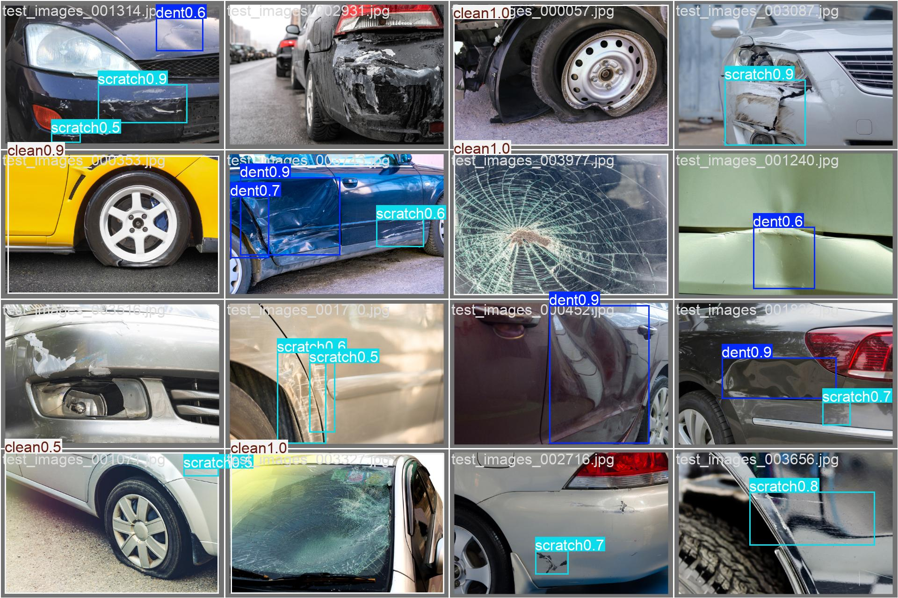
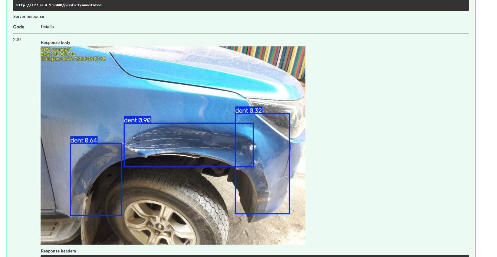
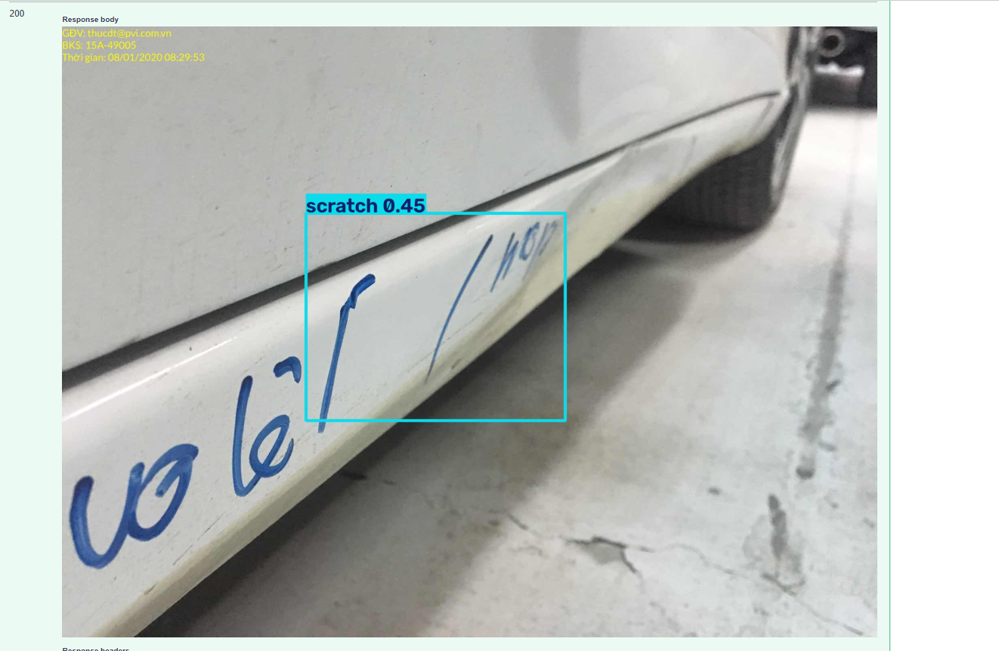
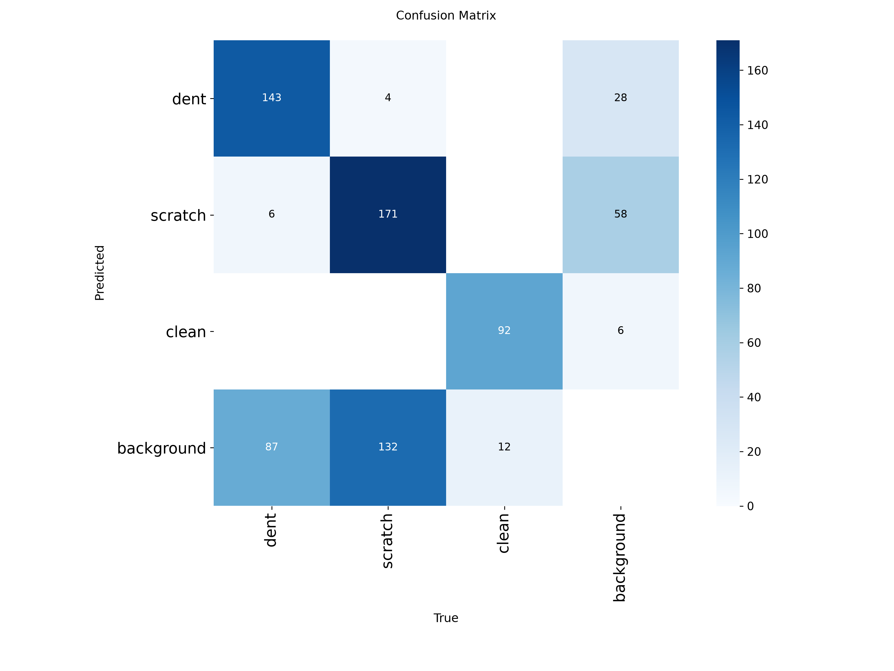

# Vehicle Damage Detection System


## Solution Overview

The proposed solution is an end-to-end computer vision system for detecting two common types of vehicle damage: **scratches and dents**.

### Dataset Source

The dataset used for this project is the **CarDD with YOLO Annotations (Images + Labels)** dataset, available on Kaggle:

https://www.kaggle.com/datasets/gabrielfcarvalho/cardd-with-yolo-annotations-images-labels

The dataset is based on the **Car Damage Detection Dataset (CarDD)** and contains vehicle images with YOLO-format bounding-box annotations for different types of car damage.

### Dataset Statistics

The original dataset contains images of vehicles with multiple categories of damage. For this project, the dataset was filtered to focus specifically on the two damage categories relevant to the vehicle damage detection task:

- **Dent**
- **Scratch**

During preprocessing, all annotations belonging to other damage categories were removed. Images that contained at least one **dent** or **scratch** annotation were retained, while images without either target class were excluded.


### Class Distribution

The dataset contains **4,000 images** divided into training, validation, and test sets. The original CarDD annotations were processed to retain only **dent** and **scratch** bounding boxes. Images containing only other damage categories, such as cracks, broken lamps, shattered glass, or flat tyres, were converted into the **clean** class for this task.

The final dataset contains three target classes:

| Split | Images | Images with Dent | Images with Scratch | Clean Images | Dent Instances | Scratch Instances | Clean Instances |
|---|---:|---:|---:|---:|---:|---:|---:|
| Train | 2,816 | 1,242 | 1,507 | 715 | 1,806 | 2,560 | 715 |
| Validation | 810 | 352 | 431 | 207 | 501 | 728 | 207 |
| Test | 374 | 157 | 183 | 104 | 236 | 307 | 104 |
| **Total** | **4,000** | **1,751** | **2,121** | **1,026** | **2,543** | **3,595** | **1,026** |

### Target Classes

- **Class 0 — Dent:** Vehicle images containing one or more dent bounding box annotations.
- **Class 1 — Scratch:** Vehicle images containing one or more scratch bounding box annotations.
- **Class 2 — Clean:** Images with no retained dent or scratch annotations. These images may still contain other damage types that are outside the scope of this model.

> **Note:** Image counts represent the number of images containing each class, while instance counts represent the total number of annotated objects (bounding boxes) for each class. Since a single image can contain multiple dents or scratches, instance counts are typically higher than image counts and classes do not necessarily sum to the total number of images.


## API

The Vehicle Damage Detection System provides a **FastAPI-based REST API** for detecting vehicle **scratches and dents** from uploaded images.

The API provides three main endpoints:

| Endpoint | Method | Description |
|---|---|---|
| `/health` | `GET` | Checks whether the API is running and whether the detection model is loaded. |
| `/predict` | `POST` | Accepts a vehicle image and returns detected damage classes, bounding boxes, and confidence scores. |
| `/predict/annotated` | `POST` | Accepts a vehicle image and returns the image with bounding boxes drawn around detected damage. |

### Health Check

```http
GET /health
```

The health endpoint can be used to verify that the API is running and that the YOLO damage detection model has been successfully loaded.

Example response:

```json
{
  "status": "ok",
  "model_loaded": true
}
```

### Damage Prediction

```http
POST /predict
```

The prediction endpoint accepts an image of a vehicle and uses the trained YOLOv8n model to detect visible **scratches** and **dents**.

The response contains information about the detected damage, including:

- Damage class.
- Confidence score.
- Bounding-box coordinates.

This endpoint is useful when another application needs to consume the model's predictions programmatically.

### Annotated Prediction

```http
POST /predict/annotated
```

The annotated prediction endpoint performs the same vehicle damage detection process but returns the uploaded image with bounding boxes drawn around the detected scratches and dents.

This endpoint is useful when users want to visually inspect the model's predictions and see exactly where the detected damage is located on the vehicle.

### Supported Image Formats

The API accepts the following image formats:

- JPEG
- JPG
- PNG
- WebP

Uploaded images are validated before inference, and images exceeding the configured maximum file size are rejected.

### Interactive API Documentation

The API includes automatically generated interactive documentation using FastAPI's Swagger UI.

After starting the application, the documentation can be accessed at:

```text
http://localhost:8000/docs
```

The Swagger interface allows users to:

1. Select an API endpoint.
2. Upload a vehicle image.
3. Run the damage detection model.
4. View the returned predictions or annotated image.

This provides a simple way to test and interact with the vehicle damage detection model without requiring users to write API client code.


### Setup

Follow the steps below to set up and run the Vehicle Damage Detection System locally using Docker.

### Prerequisites

Before getting started, make sure the following tools are installed on your system:

- [Git](https://git-scm.com/)
- [Docker](https://www.docker.com/)
- [uv](https://docs.astral.sh/uv/) *(optional if you only want to run the application using Docker)*

You can verify that the required tools are installed by running:

```bash
git --version
docker --version
```

If you plan to run the project locally without Docker, you should also verify that `uv` is installed:

```bash
uv --version
```

---

### Step 1: Clone the Repository

Clone the repository from GitHub:

```bash
git clone <repository-url>
```

Navigate into the project directory:

```bash
cd vehicle-damage-detection
```


---

### Step 2: Set Up the Python Environment (Optional)

If you want to run the application directly on your local machine before using Docker, the project uses `uv` for Python dependency management.

Synchronise the project dependencies using:

```bash
uv sync
```

This will create a virtual environment and install the dependencies defined in `pyproject.toml` using the versions locked in `uv.lock`.

Activate the virtual environment:

#### Linux / macOS

```bash
source .venv/bin/activate
```

#### Windows

```powershell
.venv\Scripts\activate
```

Run this to initiate all the packages
```bash
uv pip install -e .
```

You can then run the application locally using:

```bash
uv run uvicorn src.app.main:app --host 0.0.0.0 --port 8000
```

However, running the application locally is optional. The recommended deployment method for this project is through Docker.


---

### Quick Start with Docker

If you already have Docker installed and the project is configured correctly, the complete setup can be reduced to:

```bash
# Clone the repository
git clone https://github.com/hope205/Vehicle-Damage-Detection

# Navigate to the project
cd vehicle-damage-detection

# Build the Docker image
docker compose up --build
```

After starting the container, open the FastAPI documentation in your browser:

```text
http://localhost:8000/docs
```

You can then interact with the vehicle damage detection API directly from the Swagger UI.

---

### Training Methodology

The model training process was performed using the filtered CarDD dataset containing annotations for three vehicle damage categories: **dent**, **scratch** and **clean**

I built the model making use of a transfer learning approach. I performed tranafer learning a yolo26m model. The model training was performed on Kaggle using **NVIDIA Tesla T4 GPUs**. The data was trainned on for 50 epoch with image size of 640.


## Model Evaluation

The YOLO model was evaluated on the held-out test set using standard object detection metrics.

### Overall Performance

| Metric | Score |
|--------|------:|
| Precision | **80.74%** |
| Recall | **66.72%** |
| F1-Score | **73.06%** |
| mAP@0.5 | **61.52%** |
| mAP@0.5:0.95 | **48.68%** |

### Per-Class Performance

| Class | Precision | Recall | F1-Score | mAP@0.5 | mAP@0.5:0.95 |
|------|----------:|-------:|---------:|---------:|-------------:|
| Dent | **77.71%** | **57.63%** | **66.18%** | **49.89%** | **30.11%** |
| Scratch | **70.64%** | **54.07%** | **61.25%** | **46.56%** | **27.80%** |
| Clean | **93.88%** | **88.46%** | **91.09%** | **88.13%** | **88.13%** |

### Summary

- The model achieves an overall **F1-score of 73.06%**, balancing precision (**80.74%**) and recall (**66.72%**) for vehicle damage detection.
- The **Clean** class performs best across all metrics, indicating the model reliably distinguishes undamaged vehicles from damaged ones.
- **Dent** detection is more accurate than **Scratch** detection, while scratches remain the most challenging class due to their thin, irregular appearance and lower contrast.
- The lower **mAP@0.5:0.95** compared to **mAP@0.5** reflects the difficulty of precisely localizing dents and scratches, whose boundaries are often subjective and vary significantly in size and shape.


**Example predictions**








## Error Analysis




### Key Observations

- **Strong performance on clean vehicle detection**
  - The model performs well on the **Clean** class, correctly identifying **92 samples** with limited confusion into other categories.
  - This is reflected in the strong **precision (93.9%)** and **recall (88.5%)** scores.

- **Some overlap between dent and scratch detection**
  - The model occasionally confuses **dents and scratches**, with **4 scratches predicted as dents** and **6 dents predicted as scratches**.
  - This is expected since both damage types can share similar visual patterns, especially around areas with paint marks or shallow surface damage.

- **Background classification remains challenging**
  - The model struggles to identify the **Background** class, correctly detecting **0 out of 92 samples**.
  - Most background images are classified as **scratch (58)** or **dent (28)**, suggesting the model is picking up visual patterns that resemble vehicle damage.

- **Background false positives need improvement**
  - The model predicts **background** for 231 samples, but these predictions are incorrect.
  - These cases are mainly actual **scratch (132)**, **dent (87)**, and **clean (12)** samples, indicating that the background class needs better representation and separation during training.


## Potential Improvements

Several improvements could help address the current model limitations:

- **Improve background class learning**
  - Add more diverse background-only images and hard negative samples to help the model distinguish non-damage regions from actual vehicle damage patterns.

- **Reduce dent and scratch confusion**
  - Include more examples of subtle dents and scratches, especially cases with similar visual characteristics, to improve feature separation between both classes.

- **Use stronger augmentation strategies**
  - Apply realistic transformations such as lighting variation, reflections, blur, and different camera angles to improve robustness in real-world scenarios.

- **Fine-tune model architecture and training settings**
  - Experiment with larger YOLO variants, confidence thresholds, and hyperparameter tuning to improve detection accuracy and reduce false positives.

Overall, the model demonstrates strong performance in detecting clean and damaged vehicles. The main areas for improvement are better background discrimination, reducing false detections, and improving separation between visually similar damage types.


## Business Applications

This vehicle damage detection model can be integrated into several real-world workflows to automate inspections and reduce manual effort.

### Auto Insurance Claims Processing

Insurance providers can leverage the model to automate the initial assessment of vehicle damage submitted by policyholders. The system can:

- Pre-screen uploaded claim images.
- Detect and classify visible vehicle damage.
- Automatically populate claim information with detected damage types.

### Car Rental and Fleet Management

Rental companies and fleet operators can use the model to automatically inspect vehicles during check-in and check-out. By detecting dents and scratches from uploaded images, the system can:

- Identify new damage before and after rentals.
- Reduce disputes between customers and rental providers.

### Vehicle Service and Repair Centres

Automotive repair workshops can integrate the model into their inspection process to provide faster and more consistent damage assessments. This enables technicians to:

- Quickly identify visible damage before repairs begin.
- Generate preliminary repair reports.


### Used Vehicle Inspection

Dealerships and vehicle inspection companies can use the model during vehicle valuation and certification processes to automatically identify exterior damage before resale, helping ensure transparent and standardized vehicle condition reports.

### Fleet Maintenance

Organizations operating large fleets, such as logistics companies and ride-hailing services, can continuously monitor vehicle condition by periodically analysing images of their vehicles. Early detection of dents and scratches allows maintenance teams to schedule repairs before minor damage worsens, reducing long-term maintenance costs.


