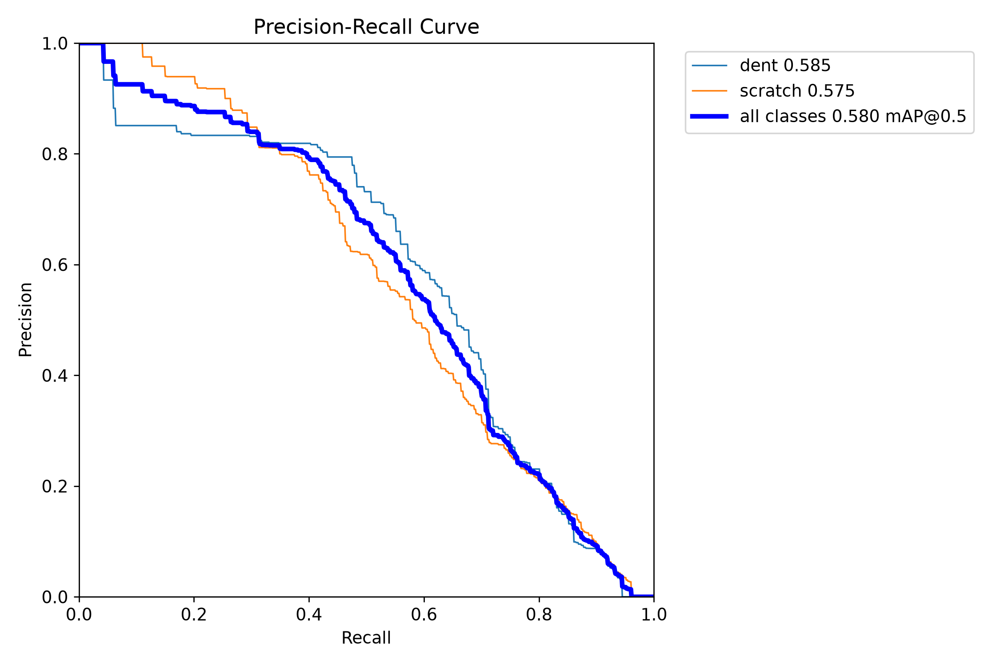
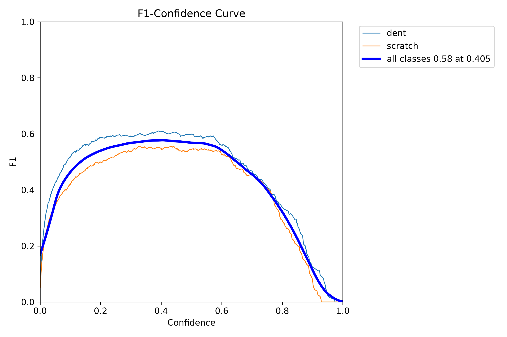
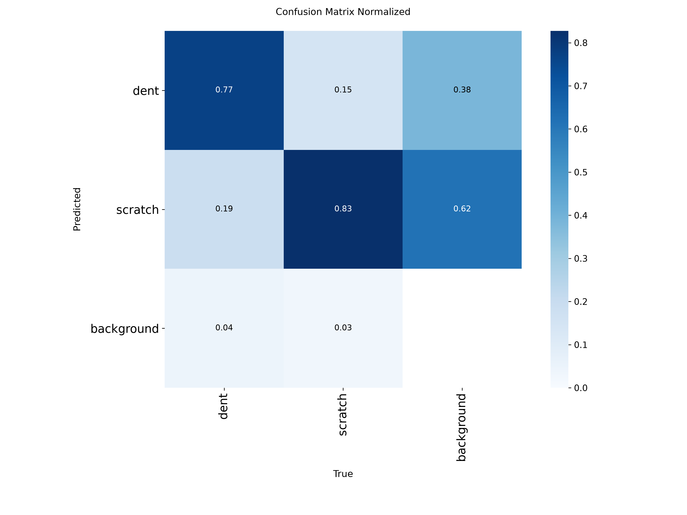
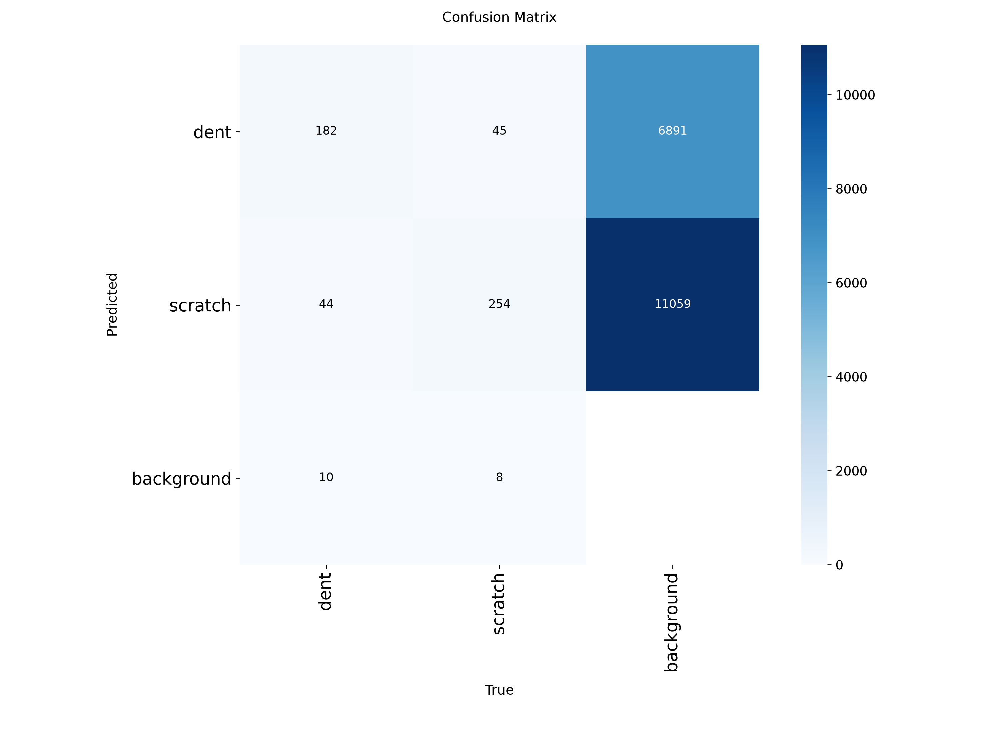

# Vehicle Damage Detection System


## Solution Overview

The proposed solution is an end-to-end computer vision system for detecting two common types of vehicle damage: **scratches and dents**.

### Dataset Source

The dataset used for this project is the **CarDD with YOLO Annotations (Images + Labels)** dataset, available on Kaggle:

https://www.kaggle.com/datasets/gabrielfcarvalho/cardd-with-yolo-annotations-images-labels

The dataset is based on the **Car Damage Detection Dataset (CarDD)** and contains vehicle images with YOLO-format bounding-box annotations for different types of car damage.

### Dataset Statistics

The original dataset contains images of vehicles with multiple categories of damage. For this project, the dataset was filtered to focus specifically on the two damage categories relevant to the vehicle damage detection task:

- **Dent**
- **Scratch**

During preprocessing, all annotations belonging to other damage categories were removed. Images that contained at least one **dent** or **scratch** annotation were retained, while images without either target class were excluded.

The resulting filtered dataset contains **6,138 annotated damage instances** across the two target classes.


### Class Distribution

After filtering the dataset to include only **dents** and **scratches**, the class distribution was:

| Class | Instances | Percentage |
|---|---:|---:|
| Dent | 2,543 | 41.43% |
| Scratch | 3,595 | 58.57% |
| **Total** | **6,138** | **100%** |

The filtered dataset contains a higher number of **scratch** annotations than **dent** annotations. Scratches account for **58.57%** of all annotated damage instances, while dents account for **41.43%**.

Overall, the class distribution is reasonably balanced, although scratches are more represented than dents.

### Number of Filtered Images

After filtering the dataset, a total of **2,974 images** containing at least one dent or scratch annotation were retained across the training, validation, and test sets.

| Dataset Split | Number of Images |
|---|---:|
| Train | 2,101 |
| Validation | 603 |
| Test | 270 |
| **Total** | **2,974** |

The filtered dataset was subsequently used to train and evaluate the YOLO-based vehicle damage detection model.

## API

The Vehicle Damage Detection System provides a **FastAPI-based REST API** for detecting vehicle **scratches and dents** from uploaded images.

The API provides three main endpoints:

| Endpoint | Method | Description |
|---|---|---|
| `/health` | `GET` | Checks whether the API is running and whether the detection model is loaded. |
| `/predict` | `POST` | Accepts a vehicle image and returns detected damage classes, bounding boxes, and confidence scores. |
| `/predict/annotated` | `POST` | Accepts a vehicle image and returns the image with bounding boxes drawn around detected damage. |

### Health Check

```http
GET /health
```

The health endpoint can be used to verify that the API is running and that the YOLO damage detection model has been successfully loaded.

Example response:

```json
{
  "status": "ok",
  "model_loaded": true
}
```

### Damage Prediction

```http
POST /predict
```

The prediction endpoint accepts an image of a vehicle and uses the trained YOLOv8n model to detect visible **scratches** and **dents**.

The response contains information about the detected damage, including:

- Damage class.
- Confidence score.
- Bounding-box coordinates.

This endpoint is useful when another application needs to consume the model's predictions programmatically.

### Annotated Prediction

```http
POST /predict/annotated
```

The annotated prediction endpoint performs the same vehicle damage detection process but returns the uploaded image with bounding boxes drawn around the detected scratches and dents.

This endpoint is useful when users want to visually inspect the model's predictions and see exactly where the detected damage is located on the vehicle.

### Supported Image Formats

The API accepts the following image formats:

- JPEG
- JPG
- PNG
- WebP

Uploaded images are validated before inference, and images exceeding the configured maximum file size are rejected.

### Interactive API Documentation

The API includes automatically generated interactive documentation using FastAPI's Swagger UI.

After starting the application, the documentation can be accessed at:

```text
http://localhost:8000/docs
```

The Swagger interface allows users to:

1. Select an API endpoint.
2. Upload a vehicle image.
3. Run the damage detection model.
4. View the returned predictions or annotated image.

This provides a simple way to test and interact with the vehicle damage detection model without requiring users to write API client code.


### Setup

Follow the steps below to set up and run the Vehicle Damage Detection System locally using Docker.

### Prerequisites

Before getting started, make sure the following tools are installed on your system:

- [Git](https://git-scm.com/)
- [Docker](https://www.docker.com/)
- [uv](https://docs.astral.sh/uv/) *(optional if you only want to run the application using Docker)*

You can verify that the required tools are installed by running:

```bash
git --version
docker --version
```

If you plan to run the project locally without Docker, you should also verify that `uv` is installed:

```bash
uv --version
```

---

### Step 1: Clone the Repository

Clone the repository from GitHub:

```bash
git clone <repository-url>
```

Navigate into the project directory:

```bash
cd vehicle-damage-detection
```


---

### Step 2: Set Up the Python Environment (Optional)

If you want to run the application directly on your local machine before using Docker, the project uses `uv` for Python dependency management.

Synchronise the project dependencies using:

```bash
uv sync
```

This will create a virtual environment and install the dependencies defined in `pyproject.toml` using the versions locked in `uv.lock`.

Activate the virtual environment:

#### Linux / macOS

```bash
source .venv/bin/activate
```

#### Windows

```powershell
.venv\Scripts\activate
```

Run this to initiate all the packages
```bash
uv pip install -e .
```

You can then run the application locally using:

```bash
uv run uvicorn src.app.main:app --host 0.0.0.0 --port 8000
```

However, running the application locally is optional. The recommended deployment method for this project is through Docker.


---

### Quick Start with Docker

If you already have Docker installed and the project is configured correctly, the complete setup can be reduced to:

```bash
# Clone the repository
git clone https://github.com/hope205/Vehicle-Damage-Detection

# Navigate to the project
cd vehicle-damage-detection

# Build the Docker image
docker build -t vehicle-damage .

# Run the container
docker run -p 8000:8000 vehicle-damage:latest
```

After starting the container, open the FastAPI documentation in your browser:

```text
http://localhost:8000/docs
```

You can then interact with the vehicle damage detection API directly from the Swagger UI.


### Model Selection

The model selection process focused on evaluating lightweight YOLO-based object detection models that could provide a good balance between detection accuracy and inference efficiency.

Two model configurations were evaluated during the initial experimentation phase:

| Model | Image Size | Batch Size | Epochs | mAP@0.5 |
|---|---:|---:|---:|---:|
| YOLO26n | 1024 × 1024 | 16 | 50 | 0.5504 |
| YOLOv8n | 640 × 640 | 16 | 50 | **0.5800** |

The **YOLO26n** model was initially used as the baseline and achieved a **mAP@0.5 of 0.5504** using an image size of **1024 × 1024**, a batch size of **16**, and **50 training epochs**.

The **YOLOv8n** model achieved a higher overall **mAP@0.5 of 0.5800** while using a smaller input image size of **640 × 640**, with the same batch size of **16** and **50 training epochs**.

Based on these results, **YOLOv8n was selected as the final model** for the vehicle damage detection system. It provided better detection performance than the YOLO26n baseline while using a smaller input resolution, making it a suitable choice for the production inference API.

The final model was trained to detect two classes:

- `dent`
- `scratch`

The trained model was subsequently integrated into the FastAPI inference service.

---

### Training Methodology

The model training process was performed using the filtered CarDD dataset containing annotations for two vehicle damage categories: **dent** and **scratch**.

The training pipeline consisted of the following steps:

1. **Dataset Preparation**
   - The original CarDD dataset was filtered to retain only `dent` and `scratch` annotations.
   - Images without either of the target damage classes were excluded.
   - The resulting dataset was organised into `train`, `val`, and `test` splits.
   - A YOLO-compatible `data.yaml` configuration file was generated to define the dataset paths and class names.

2. **Baseline Training**
   - YOLO26n was selected as the initial baseline model.
   - The baseline model was trained for **50 epochs**.
   - A batch size of **16** was used.
   - The input image size was set to **1024 × 1024 pixels**.
   - The baseline achieved a **mAP@0.5 of 0.5504**.

3. **Final Model Training**
   - YOLOv8n was subsequently evaluated as an alternative lightweight object detection model.
   - The model was trained for **50 epochs** with a batch size of **16**.
   - The input image size was set to **640 × 640 pixels**.
   - The YOLOv8n model achieved an overall **mAP@0.5 of 0.5800**.

4. **Hardware**
   - Model training was performed on Kaggle using **2 × NVIDIA Tesla T4 GPUs**.

5. **Model Selection**
   - The trained models were evaluated based on their object detection performance.
   - YOLOv8n achieved the highest mAP@0.58 of the evaluated configurations and was therefore selected as the final model for deployment.


The API accepts common image formats including JPEG, PNG, JPG, and WebP.


### Evaluation & Metrics

The primary goal of this initial training phase was to determine if the model could successfully identy scratchs and dents features of vehicle damage. The results strongly indicate that it has. 

Our model achieved an overall **mAP@0.5 of 0.580**, with closely balanced performance across our target classes:
* **Dent AP:** 0.585
* **Scratch AP:** 0.575

To optimize the model's performance in a real-world setting, I analyzed the F1-Confidence curve to find the perfect balance between Precision and Recall. The curve peaks at an F1 score of 0.58 when using a confidence threshold of **0.405**. By configuring the model to ignore predictions below this 40.5% confidence mark, we can filter out a significant portion of low-confidence noise.






### Error Analysis

A deep dive into the confusion matrices reveals a very clear story about what the model has learned, and exactly where it needs refinement. 

**Feature Recognition**
The model is highly capable of identifying actual damage. When presented with a real defect, it correctly flags scratches **83% of the time** and dents **77% of the time**. It is exceptionally rare for the model to completely miss actual damage (only missing 3-4% of the time). This proves that the foundational feature extraction is robust.




**Area for Improvement: Hyper-Sensitivity (False Positives)**
While the model performs well at finding damage,it is highly sensitive and is currently confusing environmental artifacts like sharp reflections, glare, dirt, and natural vehicle panel gaps for scratches and dents. Looking at the raw matrix counts, the model frequently hallucinates bounding boxes on the background (clean parts of the car). 



**Action Plan :**
To easily correct this hyper-sensitivity, the next training iteration will include:
1. Injecting a large volume of "background-only" images (perfectly intact vehicles under various lighting conditions) with empty annotations to force the model to learn what not to detect.
2. Isolating the specific reflections and panel gaps that caused the false positives, labeling them as background, and feeding them back into the model. Instead of two classes, we will be having three classes
3. Applying more random glare and shadow effects during training to make the model blind to lighting artifacts. 

### Business Impact & Deployment Strategy

While the current false-positive rate means this iteration isn't ready for fully autonomous, unsupervised deployment, the model's extremely low False Negative rate (its inability to miss real damage) makes it immediately valuable as a **highly first-pass filter**. 

In an automated insurance or rental inspection pipeline, this model can confidently flag potential issues for human review, ensuring no actual damage slips through the cracks. Once the false positive rate is calibrated via the negative sampling strategy outlined above, this system will be fully capable of dramatically reducing manual inspection labor, accelerating claim processing times, and standardizing damage assessments across the board.

